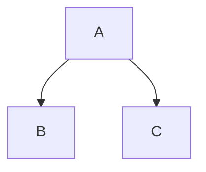

# Welcome to my test webpage
This is a place to learn

# Lets talk about Git and GitHub and begin with Markdown files
Version control is an **essential** *skill* for developers to _master_, and Git is by far the most popular ~~vrsion~~ version control system on the web. In this fast-paced course, author Ray Villalobos shows you how to install Git and use the fundamental commands you need to work with Git projects: moving files, managing logs, and working with branches.

> This is a Block Quotation

Below this is a horizontal rule
---

Below this is asterisks - a thicker horizontal rule
***

Below this is underscores
___

## Lists
1. First ordered item
  - Sub item 1
  - Sub item 2
2. Second item
   * sub item 1
   * sub item 2
       - sub sub item


## Links 

Plus, you'll [learn](https://linkedin.com) how to work with the popular GitHub website to explore existing projects, clone them to your local hard drive, and use them as templates for your new projects.
https://mylink.com

[Website](https://www.google.com "Link to Google")
[Numbered Link][1]
[Labeled-link]


[1]: https://www.linkedin.com
[Labeled-link]: https://www.google.ca 

<!-- Comments are like HTML comments -->
<!-- ## Images - similar to links but use '!'

-->

## Image as a link to another page
[]  (http://mylink.com)

## Code
Simple code in one line - the key on the keyboard is the one to the left of '1'
`int x`

Multiline code (color code for C++) 
```C++
int x;
int y; 
int z = x + y;
```

Or colour code for JavaScript
```js
let x = 6;
console.log(x);
```

# GitHub Markdown Additions - Github flavored markdown (GFM)

## Footnotes
This is footnote [^1]. We keep writing and then add another footnote [^2]

These footnotes will be placed at the bottom of the page
[^1]: Reference for footnote 1
[^2]: Reference for footnote 2

## Tables
| First col | Second col | Third col |
|:----      | :----:     | ----:     |
| A         |     B      |     C     |
| D         |     E      |  F        |


Notice that the ':' in the second row deals with alignment left, centre, right


## Task (unordered) list that is checkable
- [x] first (checked)
  - [ ] first subheading (unchecked)
- [x] second is checked
- [ ] third is unchecked
- [x] fourth item in list

## Colapsed details (in HTML)
<details>
  <summary>This is the first title of the collapsed item</summary>
  This is the hidden text in the collapsed section
</details>
<details>
  <summary>This is the second title of the collapsed item</summary>
  This is the hidden text in the second collapsed section
</details>


## Drag and Drop
You can drag and drop images into the edit tool

## Using '#' for issues or pull requests (if add number), '@' for mentions, ':' for emojis, and '\ ' for escape characters
🫀
@michaelgalle
`#FFFFFF` - This is a color
#1  - This is an issue or pull request
'\n' - This is a newline

Note: These are useful in the Pull request box 


## Alert Syntax
> [!NOTE]
> This is a note

> [!IMPORTANT]
> This is important

> [!Warning]
> THis is a warning

## Special content like Mermaid graphs


## Any HTML (with some exceptions)
<h1>This is heading 1</h1>
<p>This is paragraph 1</p>
<p>Ordered lists</p>
<ol>
  <li>List item 1</li>
  <li>List item 2</li>
</ol>
